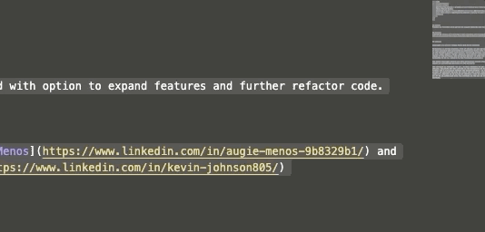

# Let's Hike App!


## Table of contents
* [General info](#general-info)
* [Intro Video](#intro-video)
* [Technologies](#technologies)
* [Setup](#setup)
* [Features](#features)
* [Status](#status)
* [Contact](#contact)
* [License](#license)


## General info
Let's Hike is a CLI application that allows users to create a login and search a database full of fun hikes for every level of Hiker! Let's Hike gives you several ways to find the right hike. You can search specifically by the amount of time you're looking to hike, 
or simply allow the app to pick a random hike for you. If you are looking for the best hike that fits your needs, try out our Find your perfect hike feature! All of the hikes can be saved in your 'favorites' to easily reference in the future.


## Intro Video

video link here. 

## Technologies
* Ruby - version 2.6.1
* ActiveRecord - version 6.0
* Sinatra - version 2.0
* Sinatra- ActiveRecord - version 2.0
* SQLite3 - version 1.4
* TTY prompt 0.22.0
* TTY box 0.6.0
* Awesome Print 1.8.0


## Setup
To run the app, install it locally by cloning the GitHub repository, and in your Terminal type:
```ruby
bundle.install
```
```ruby
ruby runner.rb
``` 

## Features
* Browse hikes based on length of time.
* Have the app return a random hike for you.
     

     


* See the listed hike details for each.
* Save your favorite hikes for the future, and remove any you wish to no    
  longer save.
    
    

* Looking for the best hike for you? Use the Find your perfect hike feature! 
      

    


## Code Examples
``` ruby
def self.filter_by_user_preferences(location_choice, difficulty_choice,     pet_choice, water_choice)
    all.where(location: location_choice, difficulty: difficulty_choice, pets_allowed: pet_choice, has_water: water_choice)
end
```

``` ruby
def ask_difficulty
    system "clear"
    @difficulty_choice = prompt.select("Choose your desired hike difficulty", %w(Easy Medium Hard))
    matching_trails = Trail.where(difficulty: @difficulty_choice)
    puts "You chose #{@difficulty_choice}, saving to your preferences.."
    sleep(1)
  end 
end
```


## Status
Project is finished with option to expand features and further refactor code.


## Contact
Created by [Augie Menos](https://www.linkedin.com/in/augie-menos-9b8329b1/) and [Kevin Johnson](https://www.linkedin.com/in/kevin-johnson805/)


## License

Copyright (c) [2020] [Augie Menos and Kevin Johnson]

Permission is hereby granted, free of charge, to any person obtaining a copy
of this software and associated documentation files (the "Software"), to deal
in the Software without restriction, including without limitation the rights
to use, copy, modify, merge, publish, distribute, sublicense, and/or sell
copies of the Software, and to permit persons to whom the Software is
furnished to do so, subject to the following conditions:

The above copyright notice and this permission notice shall be included in all
copies or substantial portions of the Software.

THE SOFTWARE IS PROVIDED "AS IS", WITHOUT WARRANTY OF ANY KIND, EXPRESS OR
IMPLIED, INCLUDING BUT NOT LIMITED TO THE WARRANTIES OF MERCHANTABILITY,
FITNESS FOR A PARTICULAR PURPOSE AND NONINFRINGEMENT. IN NO EVENT SHALL THE
AUTHORS OR COPYRIGHT HOLDERS BE LIABLE FOR ANY CLAIM, DAMAGES OR OTHER
LIABILITY, WHETHER IN AN ACTION OF CONTRACT, TORT OR OTHERWISE, ARISING FROM,
OUT OF OR IN CONNECTION WITH THE SOFTWARE OR THE USE OR OTHER DEALINGS IN THE
SOFTWARE.
